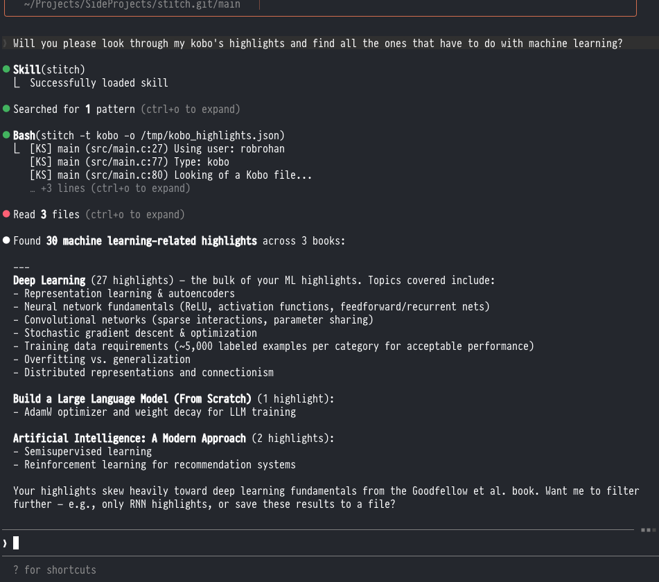

# Stitch

Stitch is a command line application that extracts highlights from Kindle and Kobo devices. It puts the output into
a local json file which can then be further processed.

## LLM Getting Started

You can use the [SKILL.md](https://github.com/robrohan/claude-skills/blob/main/skills/Stitch/SKILL.md) file to enable Claude Code (or another LLM / agent) to be able to extract highlights from your Kobo or Kindle:



## Human Getting Started

Quick example:

```bash
./stitch -t kindle -o kindle.json; \
	jq ".[].text" kindle.json \
	| sort \
	| uniq
```

```bash
cat kobo.json | jq '.[] | select(.title | contains("Le petit Nicolas")) | .'
```

Example output:

```json
[
  {
    "type": "Highlight",
    "deviceType": "Kobo",
    "id": "LTcyNDY3MDQ2NA==",
    "isbn": "9781292410074",
    "title": "Artificial Intelligence: A Modern Approach, Global Edition",
    "author": "Stuart Russell, Peter Norvig",
    "page": 0,
    "startOffset": 0,
    "endOffset": 153,
    "date": "11 10 2025 18:38",
    "text": "It is good practice to maintain data provenance for all your data. For each column in your data set, you should know the exact definition, where the data come from, what the possible values are, and who has worked on it.",
    "annotation": "",
    "annotationExtra": ""
  },
  {
    "type": "Highlight",
    "deviceType": "Kobo",
    "id": "MTg4MzU2MzA5NQ==",
    "isbn": "1230000004542",
    "title": "The War of Art",
    "author": "Steven Pressfield",
    "page": 0,
    "startOffset": 0,
    "endOffset": 32,
    "date": "12 29 2025 08:16",
    "text": "The counterfeit innovator is wildly self-confident. The real one is scared to death.",
    "annotation": "",
    "annotationExtra": ""
  },
  {}
]
```


## Running

### Environment Variables

You can set the default path to where your ereader mounts by using the following:

```bash
export STITCH_KOBO="/Volumes/KOBOeReader/.kobo/KoboReader.sqlite"
export STITCH_KINDLE="/Volumes/Kindle/documents/My Clippings.txt"
```

After those are set, you can just run `stitch -t kobo; jq "." kobo.json`, for example, to grab all the hightlights off your Kobo.

### Mac

Since the binary is not signed, you must first let Mac OS know the binary is ok to run. Do the following:

- Download the zip file
- Double click it. It will extract the file.
- Using Finder, right click on the file _stitch_, and select _Open_.
- A terminal window will open, and then close.

After that process, you can then use the binary via terminal.

Now, you can open terminal.app, and run:

```bash
% ./stitch -h
[KS] main (src/main.c:27) Using user: robrohan

Usage: ./stitch [-i input_file] [-o output_file.json] -t [kobo|kindle]

Input example:
	Kindle: '/media/robrohan/Kindle/documents/My Clippings.txt'
	Kobo: '/media/robrohan/KOBOeReader/.kobo/KoboReader.sqlite'
```

**Importing from Kindle**

Here is an example of using Mac OS to extract highlights from Kindle:

```bash
./stitch -t kindle -i "/Volumes/Kindle/documents/My Clippings.txt" -o kindle.json
```

**Importing from Kobo**

Kobo is similar:

```bash
./stitch -t kobo -i "/Volumes/KOBOeReader/.kobo/KoboReader.sqlite" -o kobo.json
```

### Mac GUI

`Stitch/Stitch.xcodeproj` also has a `StitchGUI` scheme: a native SwiftUI app that
wraps the exact same parsing code as the CLI (via `src/stitch_api.h`, a thin C API
called from Swift through a bridging header). Pick Kindle or Kobo, choose an input
file and where to save the JSON, hit Export, and the resulting highlights load into
a searchable table in the window. Build/run it from Xcode, or:

```bash
xcodebuild -project Stitch/Stitch.xcodeproj -scheme StitchGUI build
```

### Linux

Importing data on Linux is similar to Mac. However the path is based on the current user not
a global location:

**Kobo**

```bash
stitch -t kobo -i '/media/username/KOBOeReader/.kobo/KoboReader.sqlite' -o kobo.json
```

**Kindle**

```bash
stitch -t kindle -i '/media/username/Kindle/documents/My Clippings.txt' -o kindle.json
```

## Building from Source

Stitch is using _clang_ by default. You'll need to make sure that is installed and setup.

### The Basics

```bash
make
```

### SQLite

SQLite code is already included in the source directory, however to update the code you'll need
to do the following:

- Download the source into vendor (_vendor/sqlite3_).
- Then run from within that directory:
```bash
  sh configure
  make sqlite3.c
```
- Then move _sqlite3.c_ and _sqlite3.h_ into the src directory.
- From that point forward, the _vendor/sqlite3_ directory is not used.

